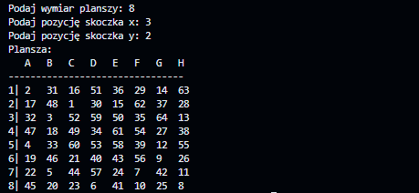

# Problem skoczka szachowego

Przez ostatni dzień zaciekawiłem się tym problemem próbując go rozwiązać.

Poniżej będę opisywać jak doszedłem do odpowiedzi oraz z jakich rozwiązań skorzystałem.


## O co chodzi?

Na początku musimy zrozumieć o co chodzi w tym problemie.

Jest on dość prosty do zrozumienia, skoczek (koń) szachowy musi przejść całą (kwadratową) planszę, stając na każdym polu tylko jeden raz.

## Przygotowania

Do napisania tego programu wybrałem język stworzony w *2012* roku przez firmę **Google**, **Go**.

Jest to szybki i prosty w użyciu język, dlatego moim zdaniem był on idealnym rozwiązaniem (pomijając fakt że zawsze chciałem się go nauczyć a jakoś nie miałem okazji).

## Pierwsze problemy i nie działające rozwiązanie

Moim pomysłem na rozwiązanie zadania była iteracja przez każdy możliwy ruch skoczka.

To rozwiązanie działa ale istnieje pewien problem.

Program sprawdza każdy dostępny ruch nie prioryteryzując oraz nie sortując kolejki. 
**Brute-force**-ujemy naszą drogę do znalezienia rozwiązania, przez to przy większych planszach (a nawet przy planszach standardowych 8x8) może to powodować pewne przeciążenia i powolne znajdowanie rozwiązań.

Jednym z głównych wad tego rozwiązania (jeżeli oczywiście chodzi o szybkość) jest **backtracking**, czyli funckja pozwalająca programowi cofnąć ruch jeżeli ten się zablokował.
Przez to algorytm musiałby iterować przez te same pola niesamowicie wiele razy.
Co gorsza jest ponad [19 trylionów](https://en.wikipedia.org/wiki/Knight%27s_tour#Number_of_tours) rozwiązań dla tego problemu (i jeszcze więcej możliwych ruchów), ten fakt jeszcze bardziej spowolania działanie programu opartego na **Brute-force** (praktycznie robi go nie możliwym do rozwiąznia).

## Research i Lepsze Rozwiązanie?

Na ratunek przyszedł **Algorytm Warndorff-a**.

Założenia algorytmu są proste, skanując dostępne ruchy ma on wybrać ruch po którym będzie najmniej dostępnych ruchów. To tylko tyle. 

Dodatkowo w [notacji dużego O](https://pl.wikipedia.org/wiki/Asymptotyczne_tempo_wzrostu), **Algorytm Warndorff-a** ma **O(n^2)** złożoności obliczeniowej w porównianiu do metody z **Brute-force**-em która ma złożoność obliczeniową o wartości **O(8^(n^2))**.

Jak się o tym dowiedziałem zabrałem się do pisania.

Zadeklarowałem wszystkie potrzebne zmienne
```go
// Deklaracja potrzebnych globalnych zmiennych
var x int
var y int
var plansza [][]int
var NextXmove, NextYMove int
var n int


func main() {
	
	var input string

	// Pobieranie od użytkownika wymiaru planszy
	fmt.Print("Podaj wymiar planszy: ")
	fmt.Scan(&input)

	var err error
	n, err = strconv.Atoi(input)
	if err != nil {
		fmt.Println("Nie podałeś liczby!")
		return
	}

	// Utworzenie planszy
	plansza = make([][]int, n)
	for i := range plansza {
		plansza[i] = make([]int, n)
	}

	// Pobieranie od użytkownika pozycji skoczka
	fmt.Print("Podaj pozycję skoczka x: ")
	fmt.Scan(&input)
	x, err = strconv.Atoi(input)
	if err != nil {
		fmt.Println("Nie podałeś liczby!")
		return
	}

	// Pobieranie od użytkownika pozycji skoczka
	fmt.Print("Podaj pozycję skoczka y: ")
	fmt.Scan(&input)

	y, err = strconv.Atoi(input)
	if err != nil {
		fmt.Println("Nie podałeś liczby!")
		return
	}

	tura := 1
	fmt.Println("Plansza:")
	answer := Warnsdorff(n, plansza, [2]int{x, y}, tura)
	
	// Wypianie końcowego wyniku
	for _, row := range answer {
		fmt.Println(row)
	}
}
```

Następnie napisałem funkcję, która podlicza dostępne ruchy z danej pozycji.

```go
func count_moves(plansza [][]int, position [2]int, n int) int {
	// tablice dostępnych ruchów
	Ymoveset := [8]int{-1, 1, 2, 2, -2, -2, -1, 1}
	Xmoveset := [8]int{-2, -2, -1, 1, -1, 1, 2, 2}
	counter := 0
	for i := 1; i <= 8; i++ {
		// Deklaracja następnej pozycji w kolejcę na podstawie starej pozycji i dostępnych ruchów
		NextXmove := position[0] + Xmoveset[i-1]
		NextYmove := position[1] + Ymoveset[i-1]
		// Jeżeli można wykonać ruch, podlicz go
		if NextXmove <= n && NextXmove >= 1 && NextYmove <= n && NextYmove >= 1 && plansza[NextYmove-1][NextXmove-1] == 0 {
			counter++
		}
	}
	return counter
}
```
Następnie utworzyłem funkcję, która jest "sercem" całego algorytmu.

W poniższym kodzie zastosowałem rekurencję ale jest też możliwość użycia iteracji (iterując przez liczbę maksymalnych ruchów, w tym przypadku 8*8=64).

```go
func Warnsdorff(n int, plansza [][]int, position [2]int, tura int) [][]int {
	// Jeżeli liczba wykonanych ruchów równa się liczbie wszystkich pól planszy zwróć rozwiązaną planszę
	if tura == n*n {
		plansza[position[1]-1][position[0]-1] = tura
		return plansza
	}
	// Największa liczba 64 bitowa
	min_counter := math.MaxInt
	// tablice dostępnych ruchów
	Ymoveset := [8]int{-1, 1, 2, 2, -2, -2, -1, 1}
	Xmoveset := [8]int{-2, -2, -1, 1, -1, 1, 2, 2}
	// Zaznaczenie w komórce na której skoczek się znajduję, który to jest ruch
	plansza[position[1]-1][position[0]-1] = tura
	for i := 1; i <= 8; i++ {
		// tymczasowe wartości x i y
		temp_x := position[0] + Xmoveset[i-1]
		temp_y := position[1] + Ymoveset[i-1]
		// liczba możliwych ruchów dla tymczasowych pozycji
		count := count_moves(plansza, [2]int{temp_x, temp_y}, n)
		// Sprawdzenie czy ruch można wykonać
		if temp_x <= n && temp_x >= 1 && temp_y <= n && temp_y >= 1 && plansza[temp_y-1][temp_x-1] == 0 {
			// Jeżeli liczba możliwych ruchów jest większa od najnowszej minimalnej liczby możliwych ruchów nadpisz pozycję i NOWE tymczasowe pozycję
			if count < min_counter {
				min_counter = count
				// tymczasowe NOWE pozycje skoczka
				NextXmove = temp_x
				NextYMove = temp_y
			}
		} else {
			continue
		}

	}
	// Zmiana pozycji skoczka
	position[0] = NextXmove
	position[1] = NextYMove
	// Inkrementacja tury
	tura++
	Warnsdorff(n, plansza, position, tura)
	return plansza
}
```


### Przykładowe rozwiązanie



Program wypisuję tablice w terminalu, liczby w nich oznaczają kolejny ruch (1 to jest pozycja startowa skoczka, 64 to pozycja końcowa)


## Cały kod

```go

package main

import (
	"fmt"
	"math"
	"strconv"
)

var x int
var y int
var plansza [][]int
var n int
var NextXmove, NextYMove int

func main() {

	var input string

	fmt.Print("Podaj wymiar planszy: ")
	fmt.Scan(&input)

	var err error
	n, err = strconv.Atoi(input)
	if err != nil {
		fmt.Println("Nie podałeś liczby!")
		return
	}

	plansza = make([][]int, n)
	for i := range plansza {
		plansza[i] = make([]int, n)
	}

	fmt.Print("Podaj pozycję skoczka x: ")
	fmt.Scan(&input)
	x, err = strconv.Atoi(input)
	if err != nil {
		fmt.Println("Nie podałeś liczby!")
		return
	}

	fmt.Print("Podaj pozycję skoczka y: ")
	fmt.Scan(&input)

	y, err = strconv.Atoi(input)
	if err != nil {
		fmt.Println("Nie podałeś liczby!")
		return
	}
	tura := 1
	fmt.Println("Plansza:")
	answer := Warnsdorff(n, plansza, [2]int{x, y}, tura)
	for _, row := range answer {
		fmt.Println(row)
	}
}
func count_moves(plansza [][]int, position [2]int, n int) int {
	Ymoveset := [8]int{-1, 1, 2, 2, -2, -2, -1, 1}
	Xmoveset := [8]int{-2, -2, -1, 1, -1, 1, 2, 2}
	counter := 0
	for i := 1; i <= 8; i++ {
		NextXmove := position[0] + Xmoveset[i-1]
		NextYmove := position[1] + Ymoveset[i-1]
		if NextXmove <= n && NextXmove >= 1 && NextYmove <= n && NextYmove >= 1 && plansza[NextYmove-1][NextXmove-1] == 0 {
			counter++
		}
	}
	return counter
}

func Warnsdorff(n int, plansza [][]int, position [2]int, tura int) [][]int {
	if tura == n*n {
		plansza[position[1]-1][position[0]-1] = tura
		return plansza
	}
	min_counter := math.MaxInt
	Ymoveset := [8]int{-1, 1, 2, 2, -2, -2, -1, 1}
	Xmoveset := [8]int{-2, -2, -1, 1, -1, 1, 2, 2}
	plansza[position[1]-1][position[0]-1] = tura
	for i := 1; i <= 8; i++ {
		temp_x := position[0] + Xmoveset[i-1]
		temp_y := position[1] + Ymoveset[i-1]
		count := count_moves(plansza, [2]int{temp_x, temp_y}, n)
		if temp_x <= n && temp_x >= 1 && temp_y <= n && temp_y >= 1 && plansza[temp_y-1][temp_x-1] == 0 {
			if count < min_counter {
				min_counter = count
				NextXmove = temp_x
				NextYMove = temp_y
			}
		} else {
			continue
		}

	}
	position[0] = NextXmove
	position[1] = NextYMove
	tura++
	Warnsdorff(n, plansza, position, tura)
	return plansza
}
```


## Podsumowanie

Bardzo ciekawy problem do rozwiązania w wolnej chwili. Zawsze można się czegoś nauczyć.

Jednak mój kod nie jest idealny, zachęcam każdego do s**fork**owania mojego [**repozytorium**](https://github.com/Piotrexx/Skoczek) i stworzenia **issue** albo **pull request**-a.
